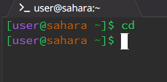
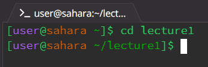
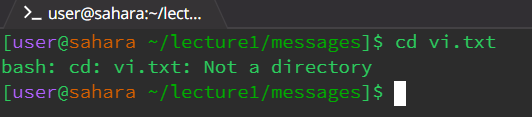
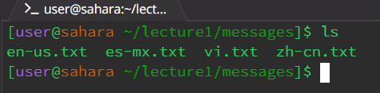
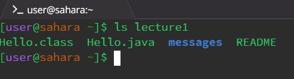
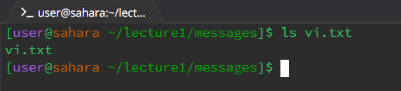
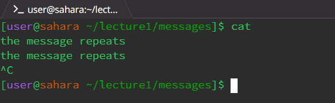
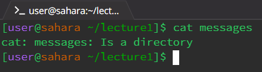
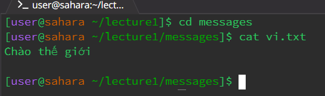

## **cd w/ no argument**

* **Working Directory When Run** - sahara
* With no argument cd simply remains in the current working directory.
---
## **cd w/ directory argument**

* **Working Directory When Run** - sahara
* When cd is used with a directory argument cd will change the current working directory to the directory that matches the argument given.
---
## **cd w/ file argument**

* **Working Directory When Run** - sahara/lecture1/messages
* When cd is used with a file argument it will produce an error stating that the file is not a directory. This is due to cd being able to only change current working direcotries, and not files.
---
## **ls w/ no argument**

* **Working Directory When Run** - sahara/lecture1/messages
* With no argument ls lists the files within the current working directory.
---
## **ls w/ directory argument**

* **Working Directory When Run** - sahara
* When ls is used with a directory argument ls will list the files within the given directory.
---
## **ls w/ file argument**

* **Working Directory When Run** - sahara/lecture1/messages
* When ls is used with a file argument it will simply print the name of the file.
---
## **cat w/ no argument**

* **Working Directory When Run** - sahara/lecture1/messages
* With no argument cat will await user inputs and print whatever was inputted until the user force stops the command.
---
## **cat w/ direcory argument**

* **Working Directory When Run** - sahara/lecture1
* When cat is used with a directory argument cat will produce an error saying that the argument given is a directory. This is due to directories having files and other directories within them, which canno't be read. 
---
## **cat w/ file argument**

* **Working Directory When Run** - sahara/lecture1/messages
* When cat is used with a file (specifically .txt) it will print what is written within the file. 
