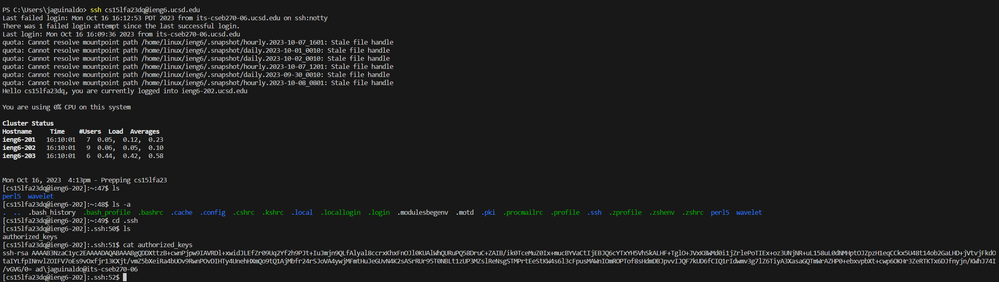

# Lab 2 Report

## **Part 1**

* The methods called are the main method, and handleRequest.
* When first actually initializing the server the value taken by the main method is a the associted port number you want the server to run on. As for handleRequest it takes an argument from the end of the URL looking for a specific key phrase. There is a num int and string value that were also initialized used for constructing the contents of the site.
* The value of num increments by 1 to represent the currnet amount of strings added (in this case it would be 1) to the webserver. It is then concatonated with the user's querry, and used to update the value of list saving the new list of words.

---

* The methods called are the main method, and handleRequest.
* When first actually initializing the server the value taken by the main method is a the associted port number you want the server to run on. As for handleRequest it takes an argument from the end of the URL looking for a specific key phrase. There is a int and string value that were also initialized used for constructing the contents of the site called "num" (int value) and "list" (string value).
* The value of num increments by 1 to represent the currnet amount of strings added (in this case it would be 2) to the webserver. It is then concatonated with the user's querry, and used to update the value of list adding more to what was already added, thus expanding the list of strings on the webserver.

---
## **Part 2**

Authorized keys on Local Device.

---

Authorized keys on ieng6.

---

No password upon remote login to ieng6.

---
## **Part 3**
***Something I Didn't Know***
---
I did not know that you were able to launch a webserver through a terminal. Being able to physically edit the server through the url search bar was something I never knew either. Basically everything that had to do with starting a server through the terminal was completely new concept to me.
