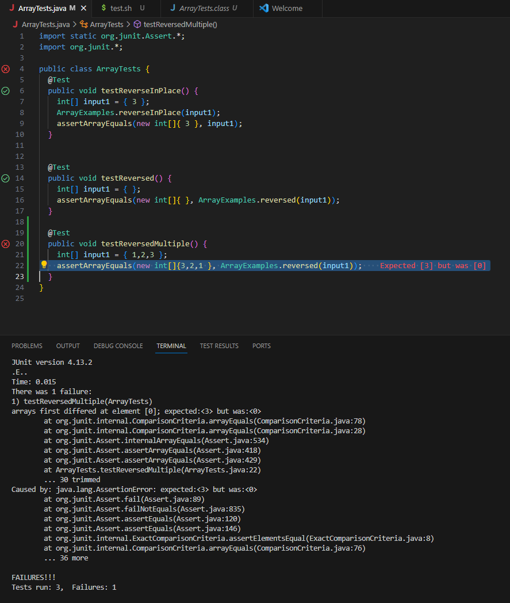

# Lab 3 Report

## **Part 1 - Bugs**
* Failure inducing input for buggy program
```
@Test
  public void testReversedMultiple() {
    int[] input1 = { 1,2,3 };
    assertArrayEquals(new int[]{3,2,1 }, ArrayExamples.reversed(input1));
```

---
* Input that does not induce failure
```
@Test
  public void testReversed() {
    int[] input1 = { };
    assertArrayEquals(new int[]{ }, ArrayExamples.reversed(input1));
```

---
* Symptom of bug from inputs



---
* Code before and after fixing the bug

**Before**
```
  static int[] reversed(int[] arr) {
    int[] newArray = new int[arr.length];
    for(int i = 0; i < arr.length; i += 1) {
      arr[i] = newArray[arr.length - i - 1];
    }
    return arr;
  }
```
**After**
```
  static int[] reversed(int[] arr) {
    int[] newArray = new int[arr.length];
    for(int i = 0; i < arr.length; i += 1) {
      newArray[i] = arr[arr.length - i - 1]; // Changed Line
    }
    return newArray;
  }
```

---
**Reason for Change**\
Sa
