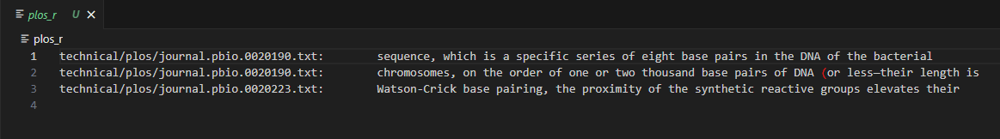
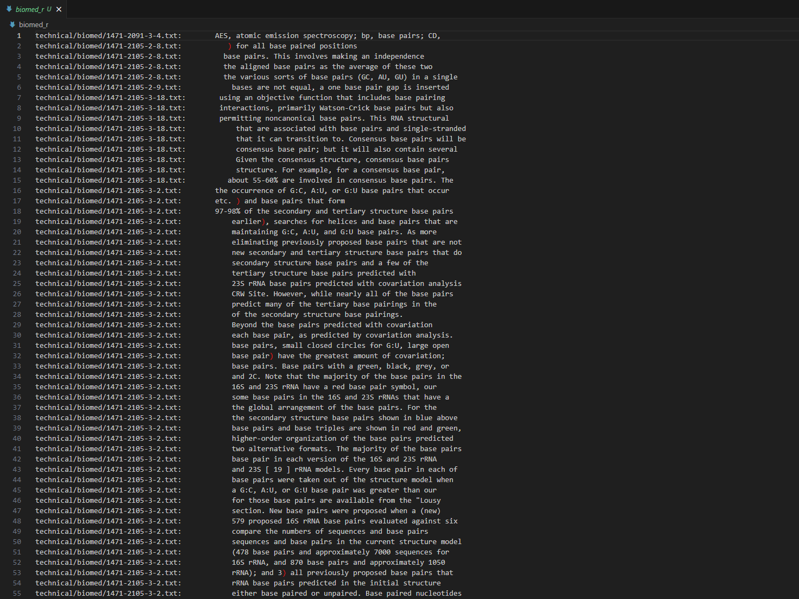
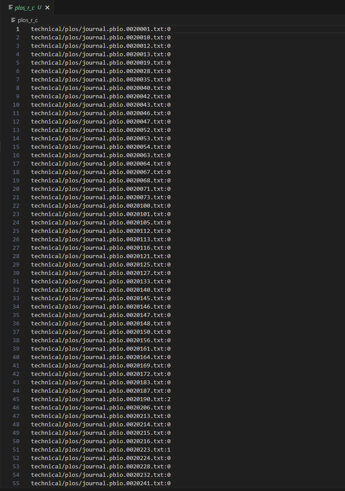
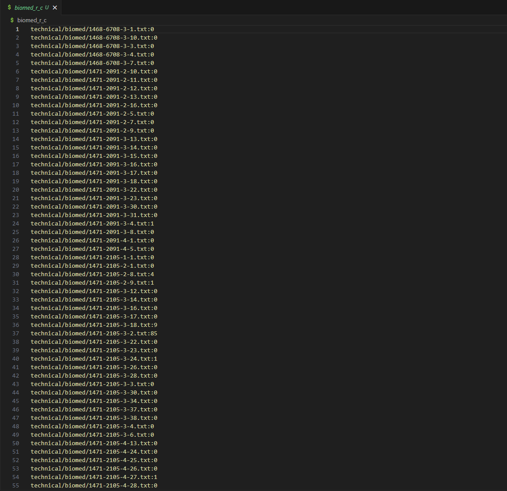
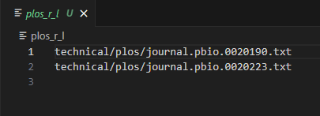
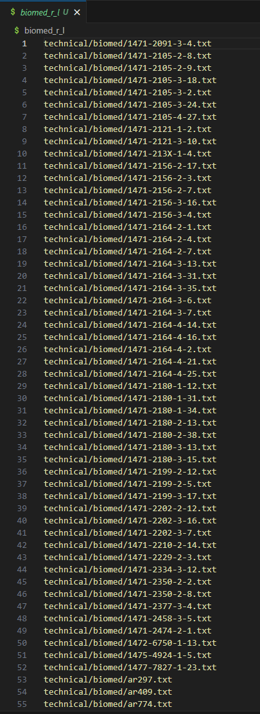
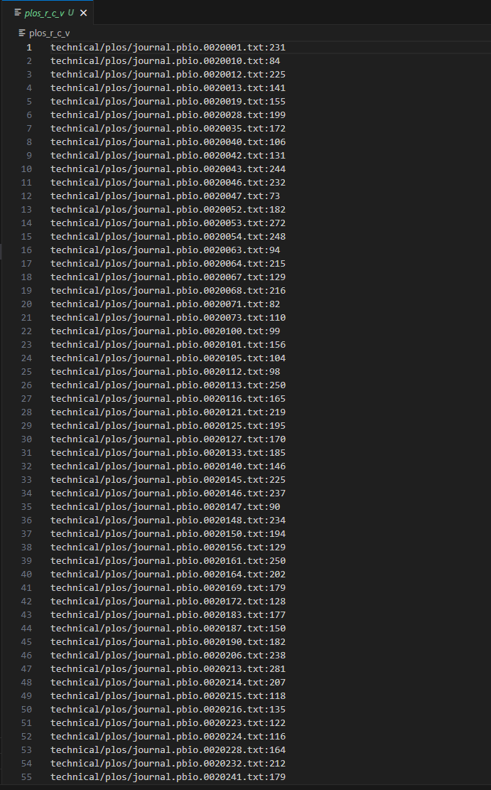
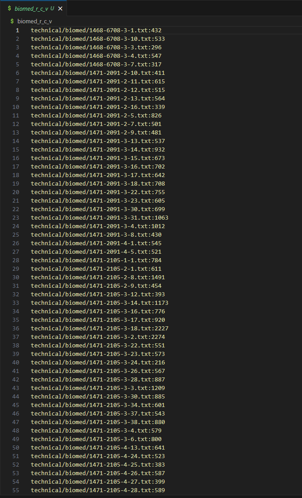

# Lab 3 Report

## **Part 1 - Bugs**
* Failure inducing input for buggy program
```
@Test
  public void testReversedMultiple() {
    int[] input1 = { 1,2,3 };
    assertArrayEquals(new int[]{3,2,1 }, ArrayExamples.reversed(input1));
```

---
* Input that does not induce failure
```
@Test
  public void testReversed() {
    int[] input1 = { };
    assertArrayEquals(new int[]{ }, ArrayExamples.reversed(input1));
```

---
* Symptom of bug from inputs


---
* Code before and after fixing the bug

**Before**
```
  static int[] reversed(int[] arr) {
    int[] newArray = new int[arr.length];
    for(int i = 0; i < arr.length; i += 1) {
      arr[i] = newArray[arr.length - i - 1];
    }
    return arr;
  }
```
**After**
```
  static int[] reversed(int[] arr) {
    int[] newArray = new int[arr.length];
    for(int i = 0; i < arr.length; i += 1) {
      newArray[i] = arr[arr.length - i - 1]; // Changed Line
    }
    return newArray;
  }
```

---
**Reason for Change:**\
The given code before change had a write up explaining that the method must return a **new** array, but when the for loop iterates instead of adding the numbers into the new array it replaces the current array with the reversed numbers. The change was that the new list of numbers are put into the newly created array. This also solves the problem where when simlpy replacing the nubmers in the list the first number will be overwritten making so the last int in the list will not be replaced properly.

## **Part 2 - Researching Commands**

**Comman Chosen: "grep"**

---

**-r (lowercase R)**
* Explaintion
```
grep -r "base pair" technical/plos
```

```
grep -r "base pair" technical/biomed
```


---

**-c (lowercase C)**
* Explaintion
```
grep -r -c "base pair" technical/plos
```

```
grep -r -c "base pair" technical/biomed
```


---

**-l (lowercase L)**
* Explaintion
```
grep -r -l "base pair" technical/plos
```

```
grep -r -l "base pair" technical/biomed
```


---

**-v (lowercase V)**
* Explaintion
```
grep -r -c -v "base pair" technical/plos
```

```
grep -r -c -v "base pair" technical/biomed
```


---

[Grep Documentation](https://github.com/ucsd-cse15l-s23/docsearch) - Has the documentation for a lot grep expression and options
