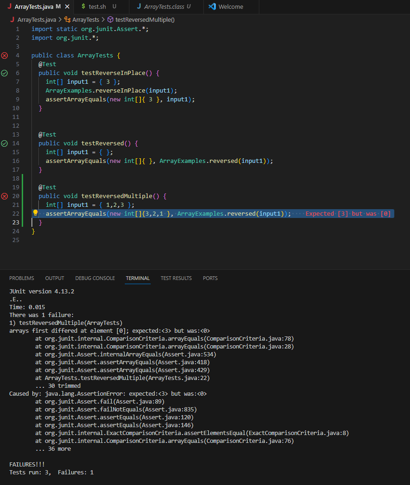

# Lab 3 Report

## **Part 1 - Bugs**
* Failure inducing input for buggy program
```
@Test
  public void testReversedMultiple() {
    int[] input1 = { 1,2,3 };
    assertArrayEquals(new int[]{3,2,1 }, ArrayExamples.reversed(input1));
```

---
* Input that does not induce failure
```
@Test
  public void testReversed() {
    int[] input1 = { };
    assertArrayEquals(new int[]{ }, ArrayExamples.reversed(input1));
```

---
* 

---
* Symptom of bug from inputs
```

```
