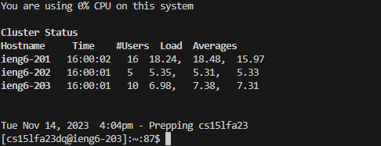
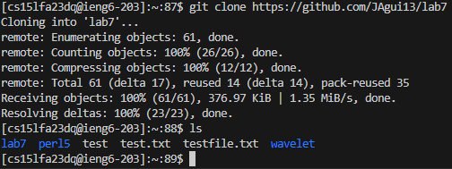
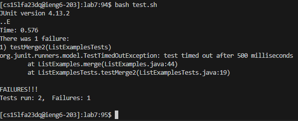
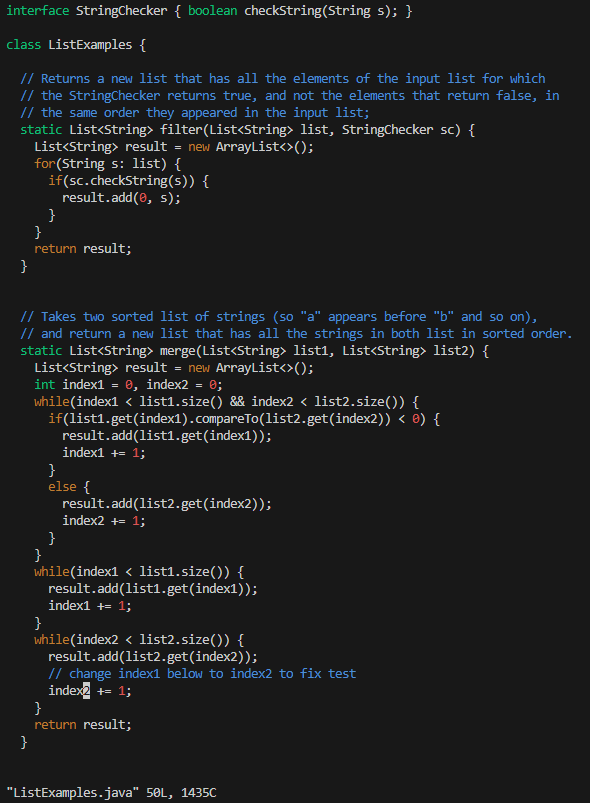
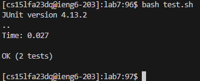
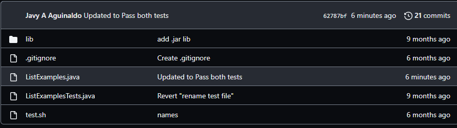

# Lab 4 Report

down key 43 times and right key 11 times
x i 2 esc :wq
up twice enter

Starting from step 4-

---

* typed "ssh" and then Ctrl-v my log in link. This logged me into the remote computer.
---

* I found the url I needed copied it and typed "git clone" and then pasted the link into the terminal. This cloned the git repository.
---

* I typed "bash test.sh" to run and test the code within the repository. This returned 2 test scucefully running and 1 returns as failed. 
---

* I edited the code by typing "vim ListExamples.java". This opened the file within a vim editor space. I then hit <down> key 43 times and <right> key 11 times to reach the error within the code. To correct it I hit x i 2 <esc> :wq. This fixed the error in the code and saved the file.
---

* I hit <up><up><enter> because the run test bash command was wihtin the terminal history.
---

* I write "git push" and "git commit" with the message being "Updated to pass both tests".
