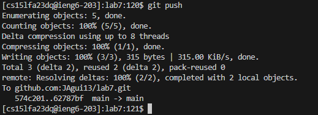

# Lab 4 Report

Starting from step 4.

---

* typed "ssh" and then Ctrl-v my login information. This logged me into the remote computer.

---
* I found the url I needed, copied it and typed "git clone" and then pasted the link into the terminal.
* The full command was `git clone https://github.com/JAgui13/lab7` within the terminal.
* This cloned the git repository.

---
* I typed `bash test.sh` to run and test the code within the repository. This returned 2 test successfully running and 1 test returns as failed.

---
* I edited the code by typing `vim ListExamples.java`. This opened the file within a vim editor space. I then hit `<down>` key 43 times and `<right>` key 11 times to reach the error within the code. To correct it I hit the `x` `i` `2` `<esc>` `<shift> + ;`(:) `w` `q` keys in that order. This fixed the error in the code and saved the file.
  

---
* I hit `<up>` `<up>` `<enter>` because the command to run the test bash command (`bash test.sh`) was within the terminal history, so I accessed it and ran the same command.
  

---
* I wrote the `git push` and `git commit` commands wihtin the terminal with the message being "Updated to pass both tests" as the change comment.
* This commited the changes to the git repositroy and saved my work.
