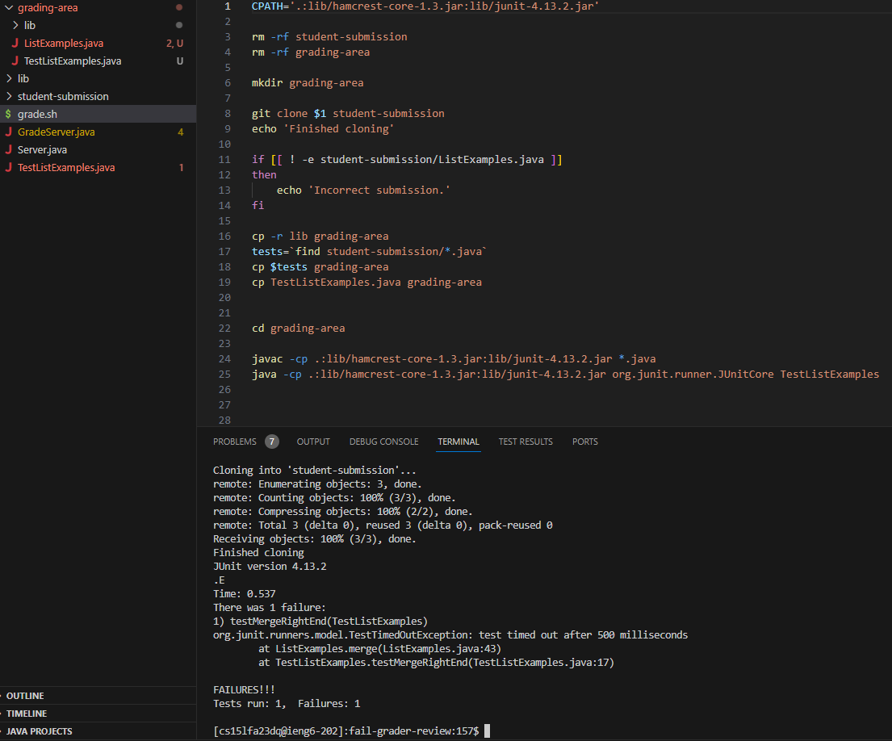
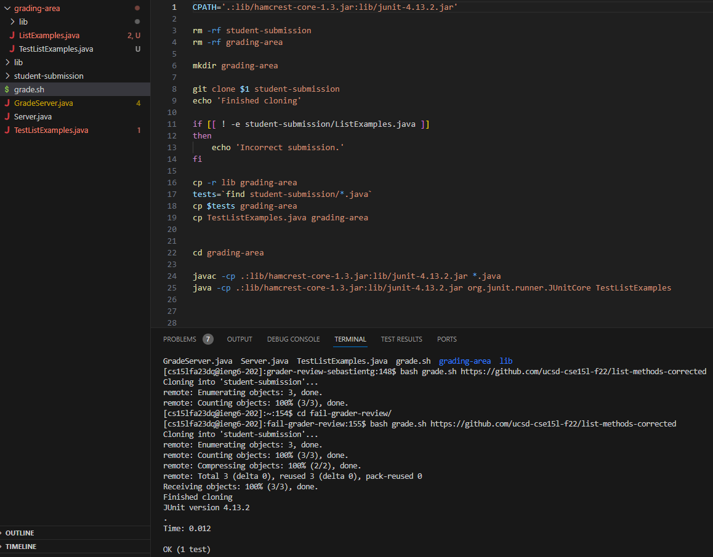
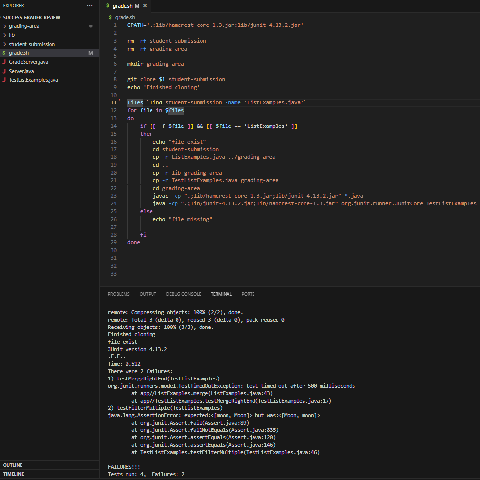
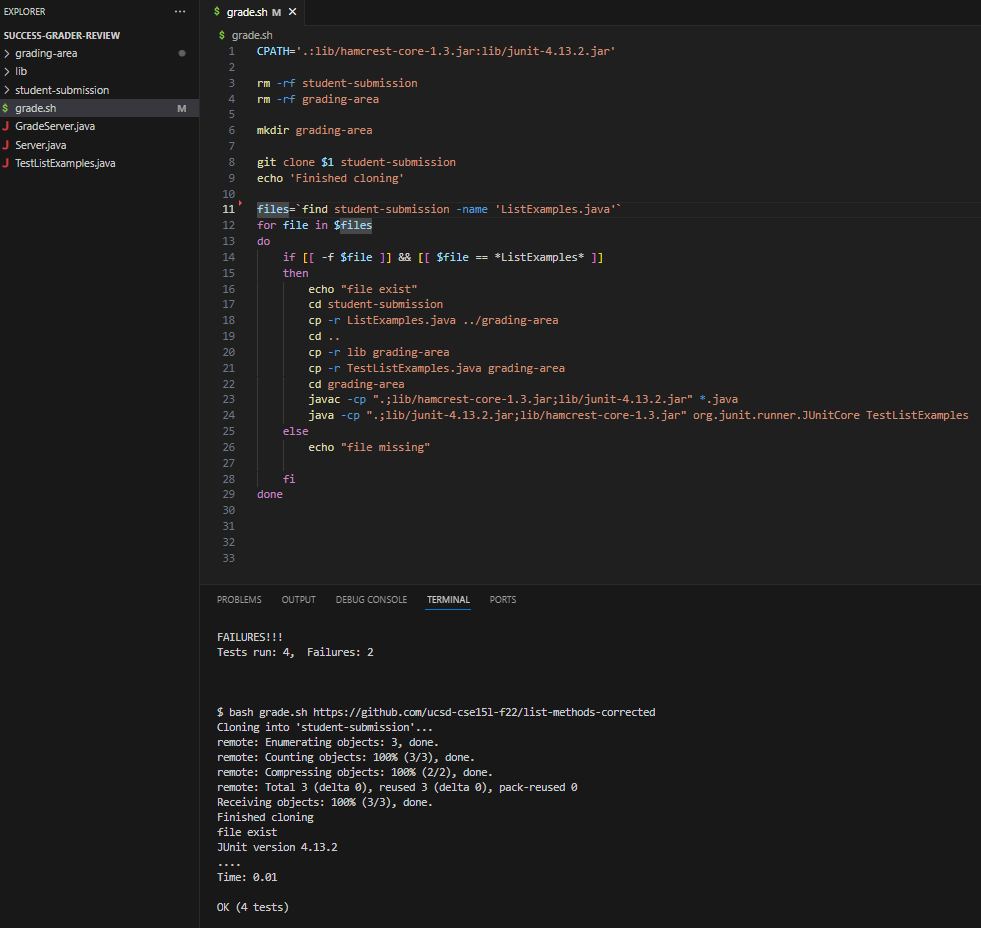

# Lab 5 Report

***CODE TAKEN AN EDITED FROM LAB 6***

## **Part 1 - Debugging Scenario**
Student Question
---
When testing the grade.sh bash script the tests come in as follows a success, and a failure respectively for the 2 different git repositories used. I'm having trouble understanding why I am getting the correct output, however there is only one test passing through. Could you help me by pointing me in the right direction?

---
* Failing unsuccessful tests

* Failing successful tests

---
TA Response
---
Looking at your code you wonder why there only shows one test being performed. Your code only executes one test within the TestListExample.java file. Try finding a method that allows you to itterate through all tests cases instead of just one.

---
After Bug Fix/ TA Suggestion
---
* Successful unsuccessful tests

* Successful successful tests

---
Information of Setup
---
* The lab6 List Example Grader [Repo](https://github.com/ucsd-cse15l-s23/list-examples-grader) Including...
  - GradeServer.java
  - Server.java
  - TestListExamples.java
  - grade.sh
* The only file that needed to be edited was grade.sh every other file was completely untouched
  - GradeServer.java: The file to create the desired test server
  - Server.java: File to initlize a server
  - TestListExamples.java: Tests to check the gradeserver code
  - grade.sh: A bash script to execute said test containing the bug
* The full command line to trigger the failing inputs are `bash grade.sh https://github.com/ucsd-cse15l-f22/list-methods-lab3` & `bash grade.sh https://github.com/ucsd-cse15l-f22/list-methods-corrected`
